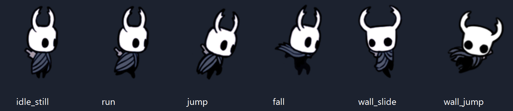
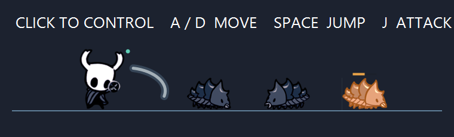

# 空洞骑士桌宠 · Hollow Knight Desktop Pet

Windows 10 / 11 x64 桌宠，使用 C#、.NET 9 和 WinForms 实现。当前版本 **v3.2.0**。



## 运行

下载 [v3.2.0 完整压缩包](https://github.com/WhiteNight-Ray/hollow-knight-desktop-pet/releases/tag/v3.2.0)，解压后双击 `app/HollowKnightPet.exe`。仓库内也保留同一可执行文件。

程序包含 .NET 运行时，运行时无需安装开发环境，也无需联网。开发和重新编译需要 Windows 与 .NET 9 SDK。

## 功能与操作

| 操作 | 功能 |
| --- | --- |
| 点击角色 / 鼠标后退侧键 XButton1 | 激活角色，右键菜单可改用 XButton2 或关闭侧键 |
| A / D | 左右移动，速度 439.07 px/s |
| Space | 短按小跳、长按高跳；吸附时蹬墙跳 |
| J | 挥刀攻击，怪物命中两次后消失 |
| 点击其他应用 / Esc | 停止操控并清空输入 |
| 拖动角色 | 调整角色位置 |
| F8 / F9 | 暂停控制 / 回到任务栏 |
| 右键角色或托盘 | 配置碰撞、吸附、刷怪频率、侧键，或退出 |

- 任务栏与可见应用窗口碰撞，支持平台模式及实体侧边 / 底边检测。
- 屏幕和窗口侧边吸附，跟随窗口移动；普通地面行走不触发吸附。
- 原作逐帧动画和任务栏爬虫，刷怪开关、间隔及侧键设置自动保存。
- 透明怪物图层不抢焦点；侧键监听运行在独立线程。
- 选中的激活侧键会拦截其原有的前进 / 后退动作，未选中的侧键正常使用。



## 项目结构

```text
app/HollowKnightPet.exe   Windows x64 独立程序
src/                     完整源码、嵌入素材及测试
build.ps1                一键发布脚本
使用说明.md              完整操作与技术说明
素材与参数来源.md        原作素材、图标、参数参考来源
测试结果.txt              v3.2 验证报告
```

`Program.cs` 管理主窗口与菜单；`Physics.cs` 处理物理、碰撞和吸附；`Native.cs` 对接 Windows API；`Controls.cs` 管理输入与设置；`ActivationShortcut.cs` 监听鼠标侧键；`Combat.cs` / `CombatArt.cs` 管理怪物与战斗；`SpriteArt.cs` 播放角色动画。

## 构建与验证

```powershell
./build.ps1
Start-Process ./app/HollowKnightPet.exe -ArgumentList '--self-test',"$PWD/tests.txt" -Wait
Start-Process ./app/HollowKnightPet.exe -ArgumentList '--smoke-test',"$PWD/smoke.json" -Wait
```

交互回归测试会短暂显示测试窗口、移动光标并模拟鼠标操作，运行时请暂勿操作鼠标键盘：

```powershell
Start-Process ./app/HollowKnightPet.exe -ArgumentList '--focus-test',"$PWD/focus-tests.txt" -Wait
```

路径包含空格时，请按[使用说明](使用说明.md)为报告路径额外加引号。已完成 49 项逻辑测试、39 项窗口交互检查，以及独立 EXE 启动检查；窗口交互检查连续三轮通过。混合缩放、多显示器和特殊全屏应用尚未完成全面实机验证。

## 素材说明

本项目是非官方个人桌宠项目。Hollow Knight 角色、美术和游戏图标属于 Team Cherry 等原权利人；它们不因包含在本仓库中而获得新的授权。素材和实现参数的具体来源见[素材与参数来源](素材与参数来源.md)。本仓库未添加开源许可证，也不将第三方游戏素材声明为原创资产。
